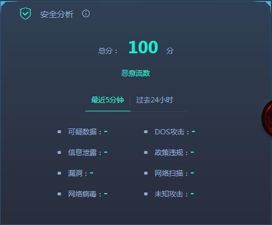
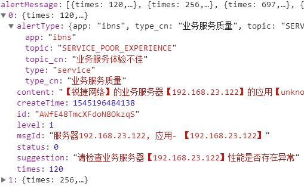
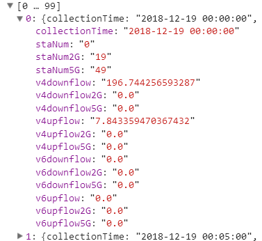
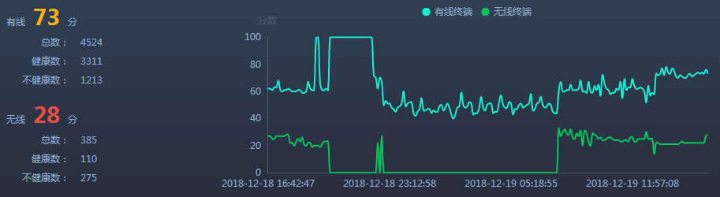
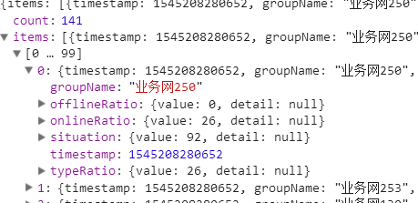
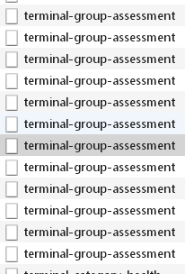
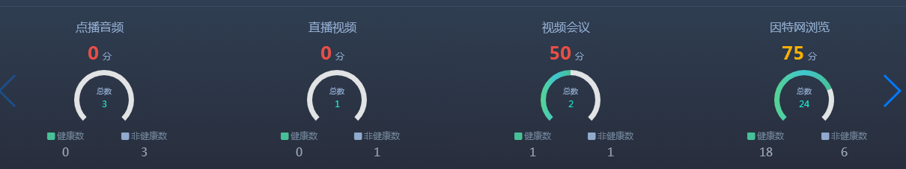
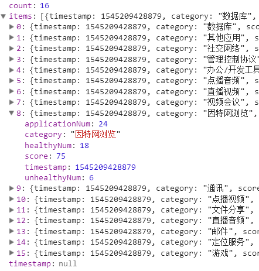
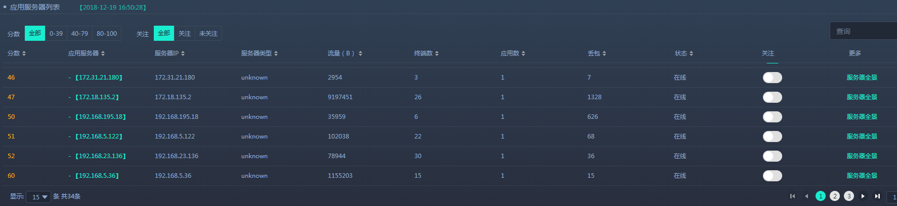
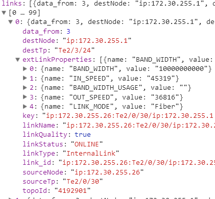

# 业务问题

## 对接mongodb

使用了单机的mongodb工具

使用了单机的mongodb连接工具，其中存在很多RDD->list以及list->RDD的操作，造成性能浪费。


同时也存在集群版的mongodb工具


从业务使用情况来看，小表用单机工具，大表用集群工具。这么做是否合理呢？或者实际上可以使用统一的方式。

另外，写入mongodb的方式也有两种。

## 代码可读性差

代码可读性较差，难以维护。


## 接口和数据库查询混合

例如app.conf中有个配置为：

```ini
deviceList = "http://rgibns1:18080/device-manager-service/v1/device"
```

其返回值的一条为：

```shell
{
    "id": 92052,
    "deviceId": "945cd170-c061-413b-a1a3-325bb28a6b47",
    "deviceName": "19#hexin_bei",
    "deviceIp": "192.168.198.42",
    "deviceVtepIp": null,
    "deviceType": "switch",
    "deviceOnline": true,
    "deviceMac": "00:1a:a9:15:6f:84",
    "devicePhyarea": null,
    "deviceLocation": null,
    "deviceManufactor": "RUIJIE",
    "deviceModel": "RG-S8606",
    "deviceRole": "ggw",
    "deviceNetRole": "core",
    "deviceSoftwareVersion": "RGOS 10.4(3b17)p5 Release(208918)",
    "deviceHardwareVersion": "1.00",
    "deviceSn": null,
    "deviceUpTime": "2018-11-23 08:47:08",
    "deviceInputConfig": null,
    "deviceProvision": "true",
    "createDate": "2018-11-01 20:47:41",
    "modifyDate": "2018-12-17 13:53:20",
    "zones": [
        {
            "id": 346051,
            "oncZoneId": null,
            "oncZoneName": null,
            "ibnsZoneId": 1402,
            "ibnsZoneName": "1402",
            "ibnsZoneIds": "1/1051/1402",
            "deploy": false
        }
    ],
    "protocolConfigurations": [
        {
            "id": 92155,
            "name": "ssh",
            "certificateId": 1452,
            "ssh": {
                "id": 92252,
                "user": "ion",
                "password": "center",
                "port": "22",
                "needsupwd": false,
                "manufactor": "RUIJIE",
                "online": true
            }
        },
        {
            "id": 92154,
            "name": "snmpv2",
            "certificateId": 1451,
            "snmpV2": {
                "id": 92202,
                "port": "161",
                "community": "ruijie",
                "online": true
            }
        },
        {
            "id": 92156,
            "name": "telnet",
            "certificateId": 2452,
            "telnet": {
                "id": 92302,
                "authMode": "USER_PASSWORD",
                "user": "huhu",
                "password": "uuu",
                "timeout": 0,
                "needsupwd": true,
                "port": 23,
                "suprompt": "111",
                "prompt": "111",
                "superPassword": "111",
                "online": false
            }
        }
    ]
}
```

这个接口能够获取设备列表，那为什么还有从devBasicInfo中获取设备列表信息呢?

另外还有设备区域信息：

```ini
http://rgibns1:18080/network-common-service/v1/zonesNofig
```

返回信息为:

```shell
{
  "id" : 1403,
  "zoneName" : "20号楼",
  "zonePicture" : null,
  "location" : "20号楼",
  "locationx" : 469.0,
  "locationy" : 138.0,
  "isArea" : false,
  "isBuilding" : true,
  "isFloor" : false,
  "zoneId" : 1051,
  "hasPicture" : false
}
```

## 可移植性问题


上图中的区域ID为固定值，这个存在可移植性问题。

## 多次读取mongodb


在一个foreachRDD中，既使用了广播方式，也读取了数据库。是否可以将这个读取数据库的操作提取到循环之外？

## 算法模型缺乏训练


仅从EtaNetflowOperate流式处理中看到使用模型进行预测，但是未找到进行模型训练的过程。因此，该模型是否能够永久有效？

#架构问题

##数据库问题

从分析保证业务保存到数据库的数据来看，以业务最大保存七天，研究院试点环境350台设备，6000台终端最大数量计算，得到表占用情况：

- 中间表占用1936.3GB的数据
- 结果表占用66.72GB

中间表和结果表都存储在mongodb中。当遇到流量突发时，会导致mongodb数据量严重倾斜，性能下降。直接影响是web响应受到影响。面对该问题，可以尝试将中间表和结果表分开存储。

###表特点

####中间表特点

**读取**

1. 需要提供分区或者索引字段，包括区域ID，IP地址，时间，以及自定义的分区或索引。
2. 支持级联查询顺序，如区域ID->IP地址->时间的级联快速查询。
3. 支持按照时间字段排序
4. 对聚合操作无需求。
5. 支持批量读取和单条读取
6. 支持查询最近1分钟、5分钟、10分钟维度的数据

**存储**

1. 支持批量存储
2. **支持更新**

####结果表特点

**读取**

1. 支持时序批量查询和单条读取
2. 支持分区或者索引字段，包括区域ID，IP地址，时间，以及自定义的分区或索引。
3. 数据不可丢失
4. 实时性能高

**存储**

1. 无或者少量存储需求
2. 支持少量的更新操作

##异步读写问题

当前的业务由Kubernetes进行任务调度管理，例如多个15分钟业务，业务本身可能在五分钟内完成。但当多个业务在同一时刻运行时，则给数据库，以及CPU带来更大的压力。是否存在一种方案能够进行调度管理或者同步读写。

## MongoDB设计

1. 是否存在冗余的索引
2. 是否存在冗余的字段（特别是和web无关的字段，应该分离）
3. 是否存在冗余的过期数据
4. 养成用 explain 确认是否充分利用了索引的习惯
5. 查询尽量采用分页，并且尽快释放游标
6. 是否可以考虑在0点至6点时间段开启数据均衡功能，然后工作时间段关闭平衡
7. 关闭TTL，使用cronjob来定时删除数据
   1. 按天分表，直接drop表是最高效的；
   2. 非按天分表，使用cronjob每日删除指定时间段的数据。

# web对应关系

区域信息URL

```http
/ionc/ibnsAgent/network-common-service/v1/zonesNofig?_=1545200763902
```


这个接口的数据在分析保证的各个模块都有出现。

## 总览

### 接口描述


####总览趋势

URL

```http
/ionc/ibnsAgent/assurance-service/v1/overview-trend
```


该接口返回趋势信息


该接口数据从zoneOvervie表中获取的时间区间的数据，而下面的区域概况则是获取一个时间点的数据。因此该接口的数据量为282条，而区域概况的数据量为10条。

[采集时间,区域,一级区域,二级区域,楼,层,区域ID,父级ID,区域名称,设备数,设备健康分数,终端数,终端健康分数,安全健康分数]

#### 问题列表

URL

```http
/ionc/ibnsAgent/assurance-service/v1/net-problem-category
```


每种type的问题，问题ID不同，而且description描述也不同，从整体上来看，这个接口是从problemList表中取的数据。

**但问题是这个接口被请求了两次。**

#### 网络总览健康

URL

```http
/ionc/ibnsAgent/assurance-service/v1/net-overview-score
```


来自于currentHealthEvaluation表的部分信息

#### 终端健康

URL

```http
/ionc/ibnsAgent/assurance-service/v1/terminal-overview-score
```


从termEvaluate表中取出的部分字段

#### 应用健康

URL

```http
/ionc/ibnsAgent/assurance-service/v1/application-overview-score
```


仅从appScoreSumInfo表中取出了健康总分

#### 安全分析

URL

```http
/ionc/ibnsAgent/assurance-service/v1/security-overview-score
```




还未实现，但根据web界面，应该是从netSecuSumInfoForTenMin表中获取。

#### 区域概况

URL

```http
/ionc/ibnsAgent/assurance-service/v1/zone-health
```


这个接口是从zoneOverview表中获取这个时间点的数据

#### AI助手（不属于分析保证业务）

##### 问题概要

URL

```http
/ionc/ibnsAgent/alertmessage/v1/actions/queryforaggs
```


##### 问题详情

URL

```http
/ionc/ibnsAgent/alertmessage/v1/actions/search-ibns
```




## 网络健康

### 接口描述

#### 网络总览趋势

URL

```http
/ionc/ibnsAgent/assurance-service/v1/net-overview-trend
```


来自于currentHealthEvaluation表的部分信息，该接口和总览-网络总览健康的数据格式一样。

#### 网络健康状况

URL

```http
/ionc/ibnsAgent/assurance-service/v1/net-health-score
```


该接口从currentHealthEvaluation表部分字段取得数据

####设备健康评估&趋势

#####当前各类设备健康评估&趋势

URL

```http
/ionc/ibnsAgent/assurance-service/v1/device-category-health
```


该接口使用了currentHealthEvaluation表的数据，进行了格式变化。

#####接入/出口/AC/AP负载排行TOP

URL

```http
/ionc/ibnsAgent/assurance-service/v1/device-category-topn
```

该接口调用了四次，正好符合设备类型有四种


该接口从deviceTop表取数据。当点击设备名称时将进入到设备全景。

#### 网络基础服务健康评估

##### 服务器健康评估基本信息

```http
/ionc/ibnsAgent/assurance-service/v1/network-service/service-base-info
```


但是发现请求列表中调用了五次


前三个分别为DHCP、DNS和RADIUS、第四个为相同的DHCP，第五个为DHCP、DNS和RADIUS的总体信息。

接口数据来源于protoResult表

##### 趋势图

```http
/ionc/ibnsAgent/assurance-service/v1/network-service/service-score-trend
```


同理，该图来源于protoResult表，且对该接口的请求为三次，分别对应着不同的协议。

##### 负载排行榜TOP10

```http
/ionc/ibnsAgent/assurance-service/v1/network-service/service-info-list
```


三种接口分别来源于dhcpSvrResult、dnsSvrResult和radiusSvrResult。

#### 无线网络健康评估 

##### 多维度分析健康分析

```http
/ionc/wisAgent/OverViewRadarScores/getRaderScore?projectId=1&areaId=5bae28f02ab9cb000e9bf3e4
```


从Wis业务中取的数据，暂时不分析，其中每个度量都可以点击，并取得统计信息。

##### 详细维度分析

######设备稳定度

```http
/ionc/wisAgent/device/getDeviceNum?projectId=1&areaId=5bae28f02ab9cb000e9bf3e4
```


```http
未找到
```


###### 关联稳定度

```http
/ionc/wisAgent/staOnOfflineAlarm/getStaAccessStability?projectId=1&areaId=5bae28f02ab9cb000e9bf3e4
```


###### 信号覆盖率

```http
/ionc/wisAgent/apCover/getLackOfCoverageAp?projectId=1&areaId=5bae28f02ab9cb000e9bf3e4
```


###### 在线体验

```http
/ionc/wisAgent/areaExperience/getStatInfoByDateTime?projectId=1&areaId=5bae28f02ab9cb000e9bf3e4
```


###### 网络饱和度

```http
/ionc/wisAgent/areaExperience/getReasonAnalysisByApGroup?projectId=1&areaId=5bae28f02ab9cb000e9bf3e4
```


###### 用户活跃度

```http
/ionc/wisAgent/User/getStaAndFlowByAraeId?projectId=1&areaId=5bae28f02ab9cb000e9bf3e4
```


该web界面由以下接口组合

```http
/ionc/wisAgent/User/getStaAndFlowByAraeId?projectId=1&areaId=5bae28f02ab9cb000e9bf3e4
```




```http
/ionc/wisAgent/User/getLastAreaStaNum?projectId=1&areaId=5bae28f02ab9cb000e9bf3e4
```


```http
/ionc/wisAgent/User/getAreaAccumulateFlow?projectId=1&areaId=5bae28f02ab9cb000e9bf3e4
```


####厂商分析

#####厂商设备占比

```http
/ionc/ibnsAgent/assurance-service/v1/device-manufacturer-ratio
```


该接口数据来源于manuCompare表

#####厂商设备健康评估对比

```http
/ionc/ibnsAgent/assurance-service/v1/device-manufacturer-health
```


该接口数据来源于manuCompare表

####设备&网络服务器列表

#####设备列表

```http
/ionc/ibnsAgent/assurance-service/v1/device
```


该接口数据来源于devHealthInfo。

#####网络服务器列表

```http
/ionc/ibnsAgent/assurance-service/v1/network-service/service-info-list
```


与网络基础服务健康评估-负载排行榜TOP10使用了同一个接口，三种接口分别来源于dhcpSvrResult、dnsSvrResult和radiusSvrResult。

##终端健康

###接口描述

#### 终端总览趋势

```http
/ionc/ibnsAgent/assurance-service/v1/terminal-overview-trend
```


该接口从termEvalueate表中取的数据

#### 终端健康状况

```http
/ionc/ibnsAgent/assurance-service/v1/terminal-health
```


该接口从termEvalueate表中取的数据

#### 有线&无线终端健康明细

```http
/ionc/ibnsAgent/assurance-service/v1/terminal-category-health
```




该接口从termEvalueate表中取的数据

#### 终端分组评估

这三种分组都同时来自于**termGroup**表

##### 基于终端类型

```http
/ionc/ibnsAgent/assurance-service/v1/terminal-group-assessment
```


##### 基于终端组

```http
/ionc/ibnsAgent/assurance-service/v1/terminal-group-assessment
```


##### 基于业务网

```http
/ionc/ibnsAgent/assurance-service/v1/terminal-group-assessment
```




总共有141个业务网，但仅仅显示8个。

存在的问题是，每次点击一个分页，都是重新请求接口数据



是否应该做成静态的数据？

#### 接入质量&连通质量


##### 有线

```http
/ionc/ibnsAgent/assurance-service/v1/terminal-quality
```


该接口数据来源于termEvalueate表

#####无线


无线部分主要是wis业务，暂时先不讨论

#### 终端列表

##### 终端列表

```http
/ionc/ibnsAgent/assurance-service/v1/terminal
```


该接口来源于terminalInfo表

##### 体验差的无线终端

```http
暂时未开发
```

##应用健康

### 接口描述

#### 应用总览趋势

```http
/ionc/ibnsAgent/assurance-service/v1/application-overview-trend
```


该接口来源于appScoreSumInfo表

#### 应用健康概况

该模块的两个接口都来源于appScoreSumInfo表

##### 总体概况

```http
/ionc/ibnsAgent/assurance-service/v1/application-category-total
```


```http
/ionc/ibnsAgent/assurance-service/v1/application-category-score
```





该接口来源于appScoreSumInfo表

#### 应用健康曲线

```http
/ionc/ibnsAgent/assurance-service/v1/application-category-trend
```


该接口来源于appScoreSumInfo表

#### 应用列表

##### 应用

```http
/ionc/ibnsAgent/assurance-service/v1/application
```


该接口来源于appBasic表

##### 应用类别

```http
/ionc/ibnsAgent/assurance-service/v1/application-category
```


该接口来源于appScoreSumInfo表

该类型存在问题：


每次点击分页都是重新拉取数据

#### 应用服务器列表

```http
/ionc/ibnsAgent/assurance-service/v1/service-discovery
```




该接口来源于serverDetailInfo表

## 安全分析

### 接口描述

#### 安全总览趋势

```http
/ionc/ibnsAgent/assurance-service/v1/security-overview-trend
```


该接口来源于netSecuSumInfoForTenMin表

#### 安全分析统计

##### 统计

```http
/ionc/ibnsAgent/assurance-service/v1/security-statistics
```


该接口来源于netSecuSumInfoForTenMin表

##### 总恶意流数趋势表

```http
/ionc/ibnsAgent/assurance-service/v1/security-trend
```


该接口来源于netSecuSumInfoForTenMin表

当每次点击右侧的恶意流类型时，都会重新请求接口。

#### 安全分组统计

##### 终端分组统计

```http
/ionc/ibnsAgent/assurance-service/v1/security-terminal-group
```


该接口来源于netSecuSumInfoForTenMin表

##### 业务网分组统计

```http
/ionc/ibnsAgent/assurance-service/v1/security-business-group
```


该接口来源于netSecuSumInfoForTenMin表

#### 恶意流列表

```http
/ionc/ibnsAgent/assurance-service/v1/security
```


该接口来源于netSecuInfo表

其中源mac和目的mac点击后会跳转到终端全景。

##问题见解

### 接口描述

#### 总览趋势

```http
/ionc/ibnsAgent/assurance-service/v1/overview-trend
```


其中的总体得分是将四个方面的分数取平均值的整数部分得到。

该接口来源于zoneOverview表

#### 网络问题

```http
/ionc/ibnsAgent/assurance-service/v1/net-problem
```


这个接口是从problemList表中取的数据。在总览-问题列表中也是调用了这个**problemList**表的数据，只是取了top10，在web中点击“更多”链接，即可跳转到该网络问题位置。

## 首页

### 当前网络状态

问题，仅仅为了从mongodb中取出健康分数，而去获取大量字段的数据，是否合理？


其中的仪表盘数据则是从四种健康中取出最后一条，取平均值的整数部分而得，右上角的“健康总览”则是跳转到“分析保证-总览”。

#### 网络健康

```http
/ionc/ibnsAgent/assurance-service/v1/net-overview-trend
```


来自于currentHealthEvaluation表的部分信息，该接口和总览-网络总览健康,网络健康-网络总览趋势的数据格式一样。

#### 应用健康

```http
/ionc/ibnsAgent/assurance-service/v1/application-overview-trend
```


该接口来源于appScoreSumInfo表，和应用健康-应用总览趋势数据格式一样

#### 终端健康

```http
/ionc/ibnsAgent/assurance-service/v1/terminal-overview-trend
```


该接口来源于termEvalueate表，和终端健康-终端总览趋势数据格式一样

#### 安全分析

```http
/ionc/ibnsAgent/assurance-service/v1/security-overview-trend
```


该接口来源于netSecuSumInfoForTenMin表，和安全分析-安全总览趋势数据格式一样

###网络趋势预测

#### 出口线路

```http
/ionc/ibnsAgent/device-manager-service/v1/outLine?_=1545228950197
```


该数据从`http://rgibns1:18080/device-manager-service/v1/outLine`接口获取

#### 状态监控

```http
/ionc/ibnsAgent/assurance-service/v1/export-bandwidth-prediction
```


这个数据的采集时间与图中显示的最后时间不匹配，这个是什么原因？

该接口数据来自outLineSumInfo表

#### 趋势预测

```http
/ionc/ibnsAgent/assurance-service/v1/export-bandwidth-prediction-long
```


该接口数据来自outLineLongSumInfo表

### 区域健康

####区域详情

```http
/ionc/ibnsAgent/assurance-service/v1/zone-overview
```


总50个区域，这个图中应该是根据指定的zoneId取的区域。

各个健康的评分是从**zoneOverview**表中获取，问题数是从**devProblemList**表中获取。设备防御信息是从防御策略接口获取，表**？？？？**

```http
/ionc/ibnsAgent/network-evaluation-service/v1/protection-detection-count
```


#### 	网络拓扑

```http
<!--nodes-->
/ionc/ibnsAgent/topology-service/v1/topology/Topo_pn:All:default/node?requireAttrFlag=0&filter=true&ibnsZoneId=1&_=1545228950270
<!--links-->
/ionc/ibnsAgent/topology-service/v1/topology/Topo_pn:All:default/link?requireAttrFlag=31&filter=true&ibnsZoneId=1&_=1545228950271
```




网络拓扑从topoInfo表，或者从`http://rgibns1:18080/topology-service/v1/topology/Topo_pn:All:default`接口获取

#### 设备全景

该全景由两部分构成，设备信息+防御信息


```http
<!--设备信息-->
/ionc/ibnsAgent/assurance-service/v1/device
```


该接口从devHealthInfo表取数据

```http
<!--防御信息-->
/ionc/ibnsAgent/network-evaluation-service/v1/protection-detection-results-by-deviceIp
```


#### 数值统计概况


```http
/ionc/ibnsAgent/assurance-service/v1/zone-overview
```


##服务器全景

###接口描述

####总览趋势


```http
/ionc/ibnsAgent/assurance-service/v1/network-service/server-trend
```


该接口来源于dhcpSvrResult表

#### 服务器基本信息


```http
/ionc/ibnsAgent/assurance-service/v1/network-service/server-base-info
```


该接口和总览趋势的接口是调用了同一个dhcpSvrResult表，但是只查询最新的一条数据。

#### 基于终端的健康交互占比


```http
/ionc/ibnsAgent/assurance-service/v1/network-service/server-base-info
```


该接口和总览趋势的接口是调用了同一个dhcpSvrResult表，但是只查询最新的一条数据。

#### 问题请求趋势


```http
/ionc/ibnsAgent/assurance-service/v1/network-service/server-trend
```


该接口来源于dhcpSvrResult表

#### 问题列表


```http
/ionc/ibnsAgent/assurance-service/v1/service-discovery-problem-list
```


该接口来源于serverDetailInfo表

#### 不健康终端列表


```http
/ionc/ibnsAgent/assurance-service/v1/network-service/server-unhealthy-terminal-list
```


该接口来源于dhcpClntResult表，点击图中的“终端MAC”可以跳转到终端全景

## 终端全景

### 接口描述

#### 总览趋势


```http
/ionc/ibnsAgent/assurance-service/v1/terminal-health-trend
```


该接口来源于terminalInfo表

#### 终端详情


```http
/ionc/ibnsAgent/assurance-service/v1/terminal
```


该接口来源于terminalInfo表

#### 终端健康状况


```http
/ionc/ibnsAgent/assurance-service/v1/terminal-health-score
```


该接口来源于terminalInfo表

#### 上网路径


```http
/ionc/ibnsAgent/assurance-service/v1/terminal-path
```


该接口有关联操作，从terminalInfo表获取到AC设备和GW设备的MAC地址或者区域信息，但不知道如何获取其IP地址，再关联到termPath表中查到上网路径的。

#### 终端应用


```http
/ionc/ibnsAgent/assurance-service/v1/terminal-application
```


该接口来源于termAppInfo表

##设备全景

###接口描述

####总览趋势


```http
/ionc/ibnsAgent/assurance-service/v1/device-health-trend
```


该接口来源于devHealthInfo表

#### 设备履历


```http
/ionc/ibnsAgent/assurance-service/v1/device
```


该接口来源于devHealthInfo表

####设备健康状况


```http
/ionc/ibnsAgent/assurance-service/v1/device-health-detail
```


该接口来源于devHealthInfo表

#### 问题列表


```http
/ionc/ibnsAgent/assurance-service/v1/device-problem
```


该接口来源于devProblemList表

#### 设备详情

##### 邻居设备信息

```http
/ionc/ibnsAgent/topology-service/v1/topology/ip:3.3.3.10/neighbors?_=1545276462960
```


未开发，且非分析保证的业务逻辑

##### 端口连接信息


```http
/ionc/ibnsAgent/device-manager-service/v1/device/detail/ip?deviceIp=172.30.255.1&_=1545276462999
```


该接口来源于devRscUsge表

##### 光模块信息

```http
/ionc/ibnsAgent/assurance-service/v1/device-fiber-info
```


该接口来源于fiberPorts表

##### 协议链路信息


```http
/ionc/ibnsAgent/device-manager-service/v1/device/detail/ip?deviceIp=172.30.255.1&_=1545276462999
```


该接口来源于devRscUsge表

#####趋势预测

######系统状态


```http
/ionc/ibnsAgent/assurance-service/v1/historyThreshold
```


该接口数据来自outLineSumInfo表

######转发状态


```http
<!--状态监控-->
/ionc/ibnsAgent/assurance-service/v1/terminal-access-bottleneck-prediction-no-predict
```


该接口数据来自outLineSumInfo表

```http
<!--趋势预测-->
/ionc/ibnsAgent/assurance-service/v1/terminal-access-bottleneck-prediction-no-predict
```


该接口数据来自outLineLongSumInfo表

##### 配置履历


该接口数据来自devConfigInfo表

##### 负载信息

##### Radio详情

##### AP履历


# web对应表

| 表名                                            |
| ----------------------------------------------- |
| zoneOvervie                                     |
| problemList                                     |
| currentHealthEvaluation                         |
| termEvaluate                                    |
| appScoreSumInfo                                 |
| netSecuSumInfoForTenMin                         |
| deviceTop                                       |
| protoResult                                     |
| dhcpSvrResult、dnsSvrResult、radiusSvrResult    |
| manuCompare                                     |
| devHealthInfo                                   |
| termGroup                                       |
| appBasic                                        |
| serverDetailInfo                                |
| netSecuInfo                                     |
| outLineSumInfo                                  |
| outLineLongSumInfo                              |
| devProblemList                                  |
| topoInfo                                        |
| dhcpClntResult、dnsClntResult、radiusClntResult |
| terminalInfo                                    |
| devRscUsge                                      |
| fiberPorts                                      |
| devConfigInfo                                   |